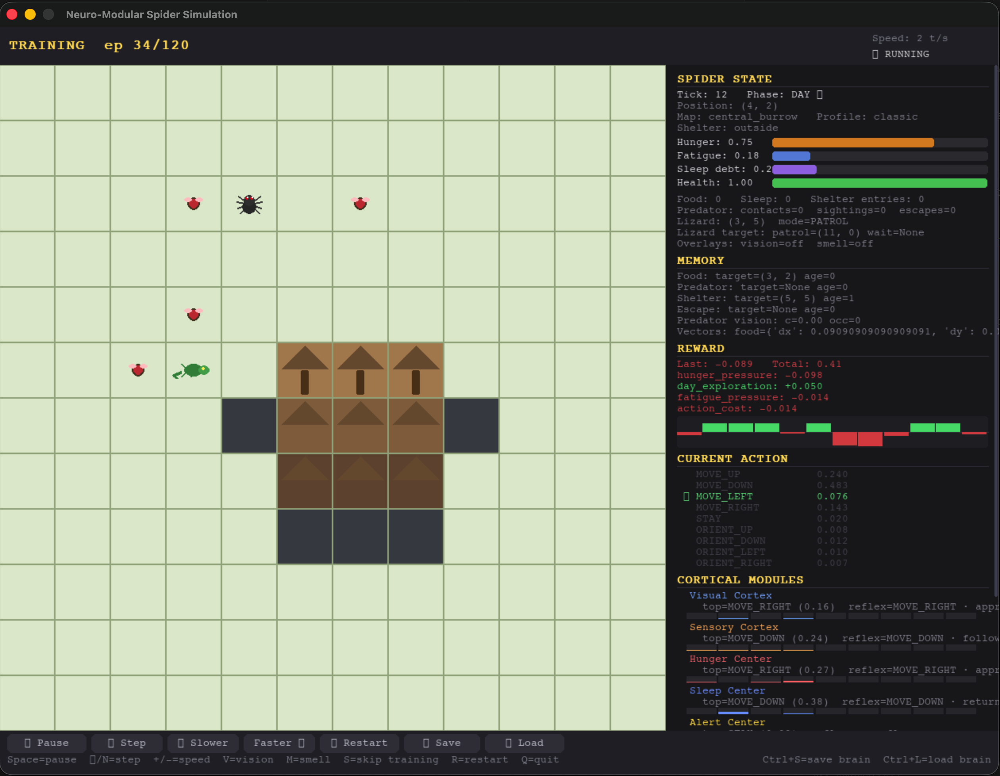

# Biologically-Inspired Organism, Not a Game



This project implements a simulated spider with a modular brain, explicit predator pressure, standardized neural interfaces, online learning, deterministic behavioral scenarios, and reproducible evaluation workflows.

The current version centers on three structural changes:

1. explicit predator instances inside the world, with a backward-compatible primary `lizard`
2. a primitive locomotion output space instead of high-level semantic actions
3. standardized input and output interfaces for each center or cortex to reduce excessive coupling between networks

That core has since been extended with:

- reward profiles (`classic`, `ecological`, `austere`)
- explicit shelter geometry with entrance, interior, and deep zones
- predator profiles for visual and olfactory hunters, including multi-predator worlds
- a richer lizard state machine (`PATROL`, `ORIENT`, `INVESTIGATE`, `CHASE`, `WAIT`, `RECOVER`)
- lizard working memory for investigate targets, ambush windows, chase streaks, and recovery
- explicit spider memory for food, predator, safe shelter, and escape route
- optional recurrent memory inside selected proposer modules
- map templates and deterministic scenarios for behavioral evaluation
- behavioral scorecards, ablations, learning-evidence workflows, reward audits, and offline analysis

The system still uses small NumPy neural networks, online learning, and independent modules, but the current architecture is closer to a simplified organism under ecological constraints.

## What Changed

### 1. Explicit Predator: The Lizard

Probabilistic nighttime danger was replaced by a concrete predator in the environment.

The lizard:

- occupies a real grid cell
- has limited vision
- moves more slowly than the spider
- cannot enter the shelter
- causes pain and health loss on contact
- can be escaped if the spider keeps moving effectively

### 2. Primitive Motor Output

The motor system no longer chooses semantic actions such as `MOVE_TO_FOOD` or `MOVE_TO_SHELTER`.

The action space is now:

- `MOVE_UP`
- `MOVE_DOWN`
- `MOVE_LEFT`
- `MOVE_RIGHT`
- `STAY`

That keeps the simulator closer to basic locomotion control instead of scripted behavior verbs.

### 3. Eating And Sleeping As Situated Behaviors

Because the motor output is now limited to locomotion, feeding and rest emerge from spatial context:

- when the spider reaches food, feeding happens automatically
- when the spider reaches shelter under fatigue or night pressure, recovery happens automatically
- staying still can still help feeding or rest, but it is no longer a rigid prerequisite

## Modular Architecture

The brain now contains five proposer modules plus `action_center` and `motor_cortex`:

1. `visual_cortex`
2. `sensory_cortex`
3. `hunger_center`
4. `sleep_center`
5. `alert_center`
6. `action_center`
7. `motor_cortex`

The first five networks propose locomotion in the same output space. `action_center` applies valence-based priority gating before final arbitration, and `motor_cortex` acts as the final locomotor executor or corrector.

The current architecture also includes:

- fixed, named interfaces per module
- module dropout during training
- local reflexes per module, defined from the module's own interface
- auxiliary per-module targets ("reflex targets") to reduce coadaptation
- optional recurrent proposer state for selected modules through `BrainAblationConfig.recurrent_modules`
- explicit contribution metrics in `action_center` for dominance, agreement, and effective proposer count
- the `local_credit_only` ablation, which preserves current inference but removes global policy-gradient broadcast during modular training

Recurrent memory is opt-in per proposer. Set `BrainAblationConfig(recurrent_modules=(...))` to make selected modules stateful within an episode, or use the canonical `modular_recurrent` and `modular_recurrent_all` ablation variants when comparing recurrent and feed-forward architectures. Hidden state resets at episode boundaries, so recurrence helps with within-episode temporal context rather than cross-episode carryover. Evaluation guidance and variant definitions live in [docs/ablation_workflow.md](docs/ablation_workflow.md).

Layer responsibilities:

- `spider_cortex_sim/world.py`: ecological dynamics, body state, and management of explicit observable memory
- `spider_cortex_sim/interfaces.py`: named contracts between world and brain
- `spider_cortex_sim/modules.py`: proposer networks only
- `spider_cortex_sim/agent.py`: local reflexes, auxiliary targets, valence gating, and final motor correction

The generated contract documentation lives in [docs/interfaces.md](docs/interfaces.md). The short topology note for the newer arbitration chain lives in [docs/action_center_design.md](docs/action_center_design.md).

## Environment

The 2D grid world contains:

- shelter or burrow (`H`)
- shelter spatial roles (`entrance`, `inside`, `deep`)
- walls or blocked cells (`#`)
- clutter terrain (`:`)
- food (`F`)
- spider (`A`)
- predator lizard or hunter instances (`L`)
- day/night cycle
- limited vision
- food and predator smell fields
- homeostatic pressures from hunger, fatigue, health, pain, and contact

If the spider and lizard occupy the same ASCII-rendered cell, the renderer shows `X`.

## Predator Profiles

Predators are configured with `PredatorProfile` values in `spider_cortex_sim/predator.py`. A profile defines the predator name, visual range, smell range, detection style, move interval, and detection threshold.

Built-in profiles:

- `DEFAULT_LIZARD_PROFILE`: backward-compatible single-predator behavior matching the classic lizard parameters
- `VISUAL_HUNTER_PROFILE`: long visual range, short smell range, `detection_style="visual"`
- `OLFACTORY_HUNTER_PROFILE`: short visual range, long smell range, `detection_style="olfactory"`

`SpiderWorld.reset()` accepts `predator_profiles=[...]`. Passing one profile preserves the old single-predator API; passing several profiles spawns one predator per profile and creates one controller per predator. The compatibility helpers still work:

- `world.lizard` and `world.lizard_pos()` refer to the first predator
- `world.predators`, `world.predator_positions()`, `world.predator_count`, and `world.get_predator(index)` expose the full predator set

Scenario setup code can also assign explicit `LizardState(profile=...)` instances when a benchmark needs hand-placed predators.

## Project Layout

```text
neuro_modular_sim/
├── README.md
├── docs/
│   ├── ablation_workflow.md
│   ├── action_center_design.md
│   └── interfaces.md
├── spider_cortex_sim/
│   ├── __main__.py
│   ├── agent.py
│   ├── bus.py
│   ├── cli.py
│   ├── gui.py
│   ├── interfaces.py
│   ├── modules.py
│   ├── nn.py
│   ├── predator.py      # PredatorProfile, DEFAULT_LIZARD_PROFILE, VISUAL_HUNTER_PROFILE, OLFACTORY_HUNTER_PROFILE
│   ├── simulation.py
│   └── world.py
└── tests/
```

## Installation

Create and activate a virtual environment:

```bash
python3 -m venv venv
source venv/bin/activate
```

Install dependencies:

```bash
pip install -r requirements.txt
```

Notes:

- `numpy` is required
- `pygame-ce` is optional and only needed for the graphical interface (`--gui`)

## Quick Start

Run a standard training and evaluation session:

```bash
PYTHONPATH=. python3 -m spider_cortex_sim --episodes 120 --eval-episodes 3 --max-steps 90
```

Save a summary and trace:

```bash
PYTHONPATH=. python3 -m spider_cortex_sim \
  --episodes 120 \
  --eval-episodes 1 \
  --max-steps 90 \
  --summary spider_summary.json \
  --trace spider_trace.jsonl
```

Render the final evaluation episode in ASCII:

```bash
PYTHONPATH=. python3 -m spider_cortex_sim \
  --episodes 120 \
  --eval-episodes 1 \
  --max-steps 90 \
  --render-eval
```

## Reward Profiles And Maps

Train with the ecological profile and an alternate map:

```bash
PYTHONPATH=. python3 -m spider_cortex_sim \
  --episodes 120 \
  --eval-episodes 3 \
  --max-steps 90 \
  --reward-profile ecological \
  --map-template side_burrow
```

Available map templates:

- `central_burrow`
- `side_burrow`
- `corridor_escape`
- `two_shelters`
- `exposed_feeding_ground`
- `entrance_funnel`

Map notes:

- `corridor_escape` uses `NARROW` terrain, representing a constrained passage
- `two_shelters` introduces two deep shelters competing with a central transition zone
- `exposed_feeding_ground` concentrates food in open terrain with more exposed approach paths
- `entrance_funnel` compresses the shelter entrance through a bottleneck that favors blocking and ambush

Reward profiles:

- `classic`: more guided, best for quick training and baseline runs
- `ecological`: less direct shaping and more pressure from world dynamics
- `austere`: minimal-progress baseline for shaping audits and contrast

## Shaping Reduction Program

The shaping-reduction program treats dense rewards as scaffolding unless they
survive an explicit audit. The working philosophy is simple: trust a behavior
more when it still appears under `austere`, where direct progress rewards,
shelter-entry bonuses, predator-escape bonuses, and day-exploration guidance
are removed or reduced. `classic` and `ecological` remain useful training and
comparison profiles, but claims should increasingly rest on behavior that
survives the austere profile.

The reduction roadmap in `spider_cortex_sim/reward.py` tracks the next reward
terms to defend, weaken, or investigate:

- `resting`: high priority, kept weakened while rest outcome evidence is
  separated from configurable rest bonuses.
- `sleep_debt_pressure`: high priority, defended only while it behaves like
  physiological pressure rather than indirect shelter guidance.
- `night_exposure`, `hunger_pressure`, and `fatigue_pressure`: medium priority,
  currently defended as ecological or physiological costs, with bounded gap
  requirements.
- `homeostasis_penalty` and `terrain_cost`: medium priority, under
  investigation because they mix legitimate ecological pressure with possible
  hidden steering.
- `action_cost`: low priority, defended as a small universal energy cost.

Gap policy defines when dense profiles are too far ahead of austere. The hard
limits are:

- `classic_minus_austere` scenario success delta <= `0.20`
- `ecological_minus_austere` scenario success delta <= `0.15`
- `classic_minus_austere` mean reward gap <= `0.50`
- `ecological_minus_austere` mean reward gap <= `0.40`
- austere survival rate >= `0.50`

Warnings fire before gates. For upper-bound gaps, the warning threshold is
`0.80 * hard_limit`. For austere survival, the warning band starts below
`0.50 / 0.80 = 0.625` and becomes a gate violation below `0.50`.

Evidence criteria classify reward terms as follows:

- `removed` or removable: austere survival reaches the threshold on all
  relevant scenarios and claim tests do not regress.
- `weakened`: austere survival reaches the threshold on a majority of relevant
  scenarios, while remaining classic/ecological gaps stay bounded.
- `defended`: the term has documented physiological or ecological necessity,
  not just behavioral convenience.
- `under_investigation`: more scenario evidence is needed before the term can
  be defended, weakened, or removed.
- `outcome_signal`: sparse outcome anchors such as feeding, predator contact,
  and death are tracked separately from dense progress shaping.

Scenario requirements decide how austere survival affects reports:

- Gate scenarios: `night_rest`, `predator_edge`, `entrance_ambush`,
  `shelter_blockade`, `two_shelter_tradeoff`,
  `visual_olfactory_pincer`, `olfactory_ambush`, and
  `visual_hunter_open_field`.
- Warning scenarios: `recover_after_failed_chase`,
  `food_vs_predator_conflict`, and `sleep_vs_exploration_conflict`.
- Diagnostic scenarios: `open_field_foraging`, `corridor_gauntlet`,
  `exposed_day_foraging`, and `food_deprivation`.

Primary claim tests now depend on austere survival. If a primary claim has
`austere_survival_required=True`, every gate scenario in that claim must pass
the austere survival threshold before the claim can pass. This applies to
`learning_without_privileged_signals`, `escape_without_reflex_support`, and
`specialization_emerges_with_multiple_predators`.

When a benchmark summary includes austere comparison data, read these fields
first:

```json
{
  "austere_survival_summary": {
    "overall_survival_rate": 0.75,
    "gate_pass_count": 6,
    "gate_fail_count": 2,
    "warning_scenarios": [],
    "gap_policy_violations": []
  },
  "austere_survival_gate_passed": false,
  "shaping_dependent_behaviors": [
    {
      "scenario": "night_rest",
      "profile": "classic",
      "success_rate_delta": 0.35,
      "limit": 0.20
    }
  ]
}
```

In this example, the overall austere rate is informative but not sufficient:
two gate scenarios failed, so primary claims that rely on those gates cannot be
treated as valid. The `shaping_dependent_behaviors` entry says `classic`
outperformed `austere` on `night_rest` beyond the policy limit, so the roadmap
should treat the relevant rest or sleep terms as reduction risks.

## Deterministic Scenarios

Run a single scenario:

```bash
PYTHONPATH=. python3 -m spider_cortex_sim \
  --episodes 0 \
  --eval-episodes 0 \
  --scenario night_rest
```

Run the full scenario suite:

```bash
PYTHONPATH=. python3 -m spider_cortex_sim \
  --episodes 0 \
  --eval-episodes 0 \
  --scenario-suite
```

Available scenarios:

- `night_rest`
- `predator_edge`
- `entrance_ambush`
- `open_field_foraging`
- `shelter_blockade`
- `recover_after_failed_chase`
- `corridor_gauntlet`
- `two_shelter_tradeoff`
- `exposed_day_foraging`
- `food_deprivation`
- `visual_olfactory_pincer`
- `olfactory_ambush`
- `visual_hunter_open_field`
- `food_vs_predator_conflict`
- `sleep_vs_exploration_conflict`

Scenario-to-map specializations include:

- `entrance_ambush`, `shelter_blockade`, and `recover_after_failed_chase` use `entrance_funnel`
- `open_field_foraging` and `exposed_day_foraging` use `exposed_feeding_ground`
- `visual_olfactory_pincer` and `visual_hunter_open_field` use `exposed_feeding_ground`
- `olfactory_ambush` uses `entrance_funnel`
- `corridor_gauntlet` uses `corridor_escape`
- `two_shelter_tradeoff` uses `two_shelters`

Multi-predator scenario intent:

- `visual_olfactory_pincer`: the spider starts between a visible visual hunter in front and an olfactory hunter behind and downwind; it tests dual-threat perception and module specialization
- `olfactory_ambush`: an olfactory hunter waits near a shelter entrance where the spider can smell danger without seeing it; it targets sensory-cortex-led response
- `visual_hunter_open_field`: a fast visual hunter pressures the spider in open terrain; it targets visual-cortex-led response under exposed conditions

## Behavioral Evaluation

Run the full behavioral suite with explicit scorecards:

```bash
PYTHONPATH=. python3 -m spider_cortex_sim \
  --episodes 0 \
  --eval-episodes 0 \
  --behavior-suite \
  --full-summary
```

Run one behavioral scenario and export flat CSV:

```bash
PYTHONPATH=. python3 -m spider_cortex_sim \
  --episodes 0 \
  --eval-episodes 0 \
  --behavior-scenario night_rest \
  --behavior-csv spider_behavior.csv \
  --full-summary
```

`summary["behavior_evaluation"]` includes:

- `suite`: aggregated scenario scorecards with `success_rate`, `checks`, `behavior_metrics`, `diagnostics`, and `failures`
- `summary`: overall suite success and detected regressions
- `comparisons`: optional profile/map/seed comparison matrices when behavioral comparison flags are used
- `learning_evidence`: optional comparison between a trained checkpoint and controls such as `random_init`, `reflex_only`, `freeze_half_budget`, and `trained_long_budget`
- `claim_tests`: optional experiment-of-record synthesis that composes the canonical learning-evidence, ablation, and noise-robustness primitives into per-claim pass/fail results

Weak-signal scenarios now publish scenario-owned interpretation metadata:

- `diagnostic_focus`
- `success_interpretation`
- `failure_interpretation`
- `budget_note`

The scenario diagnostics block also summarizes:

- `primary_outcome`
- `outcome_distribution`
- `partial_progress_rate`
- `died_without_contact_rate`

### Capability Probes

Behavioral scenarios are split between emergence gates and capability probes.
Emergence gates support claim tests: they ask whether learned behavior remains
present without privileged support, improves with memory, survives noise, or
specializes by predator type. Capability probes map narrower behavioral
boundaries inside the full benchmark. They can score `0.00` while still
producing interpretable evidence through `failure_mode`, `progress_band`, and
`outcome_band`.

The explicit capability probes are:

| Scenario | Target skill | Acceptable partial progress |
| --- | --- | --- |
| `open_field_foraging` | `food_vector_acquisition_exposed` | Any positive `food_distance_delta` or `left_shelter` with food signal present indicates food-vector acquisition capability even if `foraging_viable` fails. |
| `corridor_gauntlet` | `corridor_navigation_under_threat` | Any positive `food_distance_delta` without contact indicates corridor navigation capability; `survived_no_progress` indicates shelter-exit failure distinct from navigation failure. |
| `exposed_day_foraging` | `daytime_foraging_under_patrol` | Any positive `food_distance_delta` indicates foraging capability even under threat; `cautious_inert` indicates arbitration chose safety over food. |
| `food_deprivation` | `hunger_driven_commitment` | `commits_to_foraging=True` with `approaches_food=True` indicates commitment capability even if `timing_failure` prevents full success. |

These four scenarios remain in the full behavioral benchmark with
`benchmark_tier="capability"` and `is_capability_probe=True`. They are excluded
from claim tests because their role is to expose capability boundaries and
calibration outcomes, not to serve as pass/fail evidence for the repository's
emergence hypotheses.

## Emergence Hypothesis

The scientific question in this repository is narrower than "does the score go up?" The emergence hypothesis is that the modular cortex learns reusable threat-sensitive behavior that remains present when privileged supports are removed, stays coherent under disturbance, and differentiates between predator types rather than collapsing into one generic escape reflex.

The supporting workflows still matter, but they are no longer the experiment-of-record by themselves:

- ablations isolate which modules and memory pathways matter
- learning-evidence comparisons separate trained behavior from initialization or reflex-only baselines
- the noise matrix checks whether behavior survives train/eval mismatch

Those workflows provide the raw evidence. The claim test suite is the formal gate that reads them together and decides whether the core scientific claims actually hold.

## Claim Test Suite

Run the canonical claim suite and write the full experiment record to JSON:

```bash
PYTHONPATH=. python3 -m spider_cortex_sim \
  --claim-test-suite \
  --summary results.json
```

The five canonical claim tests are:

- `learning_without_privileged_signals`
  Hypothesis: trained behavior still beats an untrained policy after privileged reflex support is removed.
  Protocol: learning-evidence comparison from `random_init` to `trained_without_reflex_support` across `night_rest`, `predator_edge`, `entrance_ambush`, `shelter_blockade`, and `two_shelter_tradeoff`, with the leakage audit enforced.
  Success criterion: `trained_without_reflex_support` must improve `scenario_success_rate` over `random_init` by at least `0.15` and the leakage audit must report zero unresolved privileged-signal findings.

- `escape_without_reflex_support`
  Hypothesis: predator escape remains learned behavior rather than a reflex-only artifact.
  Protocol: learning-evidence comparison from `reflex_only` to `trained_without_reflex_support` over `predator_edge`, `entrance_ambush`, and `shelter_blockade`.
  Success criterion: `trained_without_reflex_support` must reach predator-response `scenario_success_rate >= 0.60` and exceed `reflex_only` by at least `0.10`.

- `memory_improves_shelter_return`
  Hypothesis: recurrent memory improves delayed shelter return and shelter trade-off behavior.
  Protocol: ablation comparison of `modular_recurrent` versus `modular_full` on `night_rest` and `two_shelter_tradeoff`.
  Success criterion: `modular_recurrent` must improve shelter-return `scenario_success_rate` by at least `0.10`.

- `noise_preserves_threat_valence`
  Hypothesis: threat-sensitive arbitration survives train/eval noise mismatch instead of working only on the diagonal.
  Protocol: canonical noise-robustness matrix, comparing diagonal and off-diagonal aggregate scores over the threat-response scenarios.
  Success criterion: the off-diagonal threat-response score must stay at least `0.60`, and the diagonal-minus-off-diagonal gap must stay at most `0.15`.

- `specialization_emerges_with_multiple_predators`
  Hypothesis: multiple predator ecologies produce predator-type specialization instead of one undifferentiated threat pathway.
  Protocol: predator-type ablation comparison across `visual_olfactory_pincer`, `olfactory_ambush`, and `visual_hunter_open_field`, paired with type-specific cortex engagement checks in the full modular policy.
  Success criterion: `drop_visual_cortex` must drive `visual_minus_olfactory_success_rate <= -0.10`, `drop_sensory_cortex` must drive `visual_minus_olfactory_success_rate >= 0.10`, and the reference policy must show the expected cortex engagement in at least `2` of the `3` specialization scenarios.

Generic benchmarks such as the ablation suite and the noise matrix still provide the supporting detail, but the claim tests are the scientific nucleus: they are the concise pass/fail record for whether the main emergence story survives contact with the actual measurements.

## Graphical Interface (Pygame)

```bash
PYTHONPATH=. python3 -m spider_cortex_sim \
  --gui \
  --episodes 120 \
  --eval-episodes 3 \
  --max-steps 90 \
  --reward-profile classic \
  --map-template central_burrow
```

The GUI displays:

- the predator lizard on the grid
- shelter roles and terrain types
- contact, sighting, and escape counters
- lizard position, mode, and current target
- explicit spider memory and sleep debt
- recent reward components
- nighttime shelter-role distribution and predator-state occupancy

Useful shortcuts:

- `V`: toggle visibility overlay
- `M`: toggle smell heatmap

## Saving And Loading The Brain

Train and save:

```bash
PYTHONPATH=. python3 -m spider_cortex_sim \
  --episodes 120 --eval-episodes 3 --max-steps 90 \
  --save-brain spider_brain
```

Load and continue training:

```bash
PYTHONPATH=. python3 -m spider_cortex_sim \
  --episodes 60 --eval-episodes 3 --max-steps 90 \
  --load-brain spider_brain \
  --save-brain spider_brain
```

Load only selected modules:

```bash
PYTHONPATH=. python3 -m spider_cortex_sim \
  --episodes 60 --eval-episodes 3 --max-steps 90 \
  --load-brain spider_brain \
  --load-modules visual_cortex hunger_center
```

Compatibility notes:

- the current architecture uses an explicit interface signature
- older saves predating the current interface standardization are rejected with explicit incompatibility errors
- older checkpoints predating `sleep_phase`, `rest_streak`, `sleep_debt`, shelter-role signals, certainty/occlusion signals, explicit memory, or oriented perception are also incompatible with the current architecture
- the versioned interface registry and generated contract docs are in [docs/interfaces.md](docs/interfaces.md)

Because interface descriptions are part of the current fingerprinted metadata, this English translation pass also changes interface and architecture fingerprints. Older checkpoints may therefore fail compatibility checks even though behavior and identifiers were not intentionally refactored.

## Tests

Run the full suite:

```bash
PYTHONPATH=. python3 -m unittest discover -s tests -v
```

The tests cover:

- standardized interface shapes and generated interface docs
- contextual feeding and rest
- auditable reward decomposition
- sleep progression `SETTLING -> RESTING -> DEEP_SLEEP`, sleep debt, and interruptions
- predator contact with real damage
- shelter geometry and occlusion
- explicit spider memory
- map templates and reachability
- deterministic scenario regressions
- memory-guided escape and foraging after loss of sight
- scenario runners and deterministic predator-response latency
- online parameter updates
- lightweight trainability checks across reward profiles, comparisons, and alternate maps

## Metrics And Tracing

The `summary` and `trace` include:

- per-step `reward_components`
- `reward_audit`, including component inventory, shaping categories, and leakage candidates
- nighttime shelter occupancy and nighttime stillness
- nighttime shelter-role distribution (`outside`, `entrance`, `inside`, `deep`)
- predator-response latency
- predator contacts, escapes, and response latency by predator type
- dominant module response by predator type
- `reward_profile` and `map_template`
- `config.operational_profile`, including active thresholds and operational weights
- `config.budget`, including resolved profile, benchmark strength, seeds, and explicit overrides
- `checkpointing` when `--checkpoint-selection best` is used
- explicit certainty and occlusion fields per visual channel
- world-layer maintained `heading` and decayed percept traces in trace metadata
- explicit `predator_motion_salience`
- normalized memory vectors in trace metadata
- predator occupancy by state (`PATROL`, `ORIENT`, `INVESTIGATE`, `CHASE`, `WAIT`, `RECOVER`)
- predator state transitions and dominant predator state per episode or scenario
- food and shelter distance deltas
- `event_log` stages per tick
- behavioral scorecards per scenario in `behavior_evaluation`
- diagnostic per-episode bands such as `progress_band` and `outcome_band`
- explicit `action_center` arbitration outputs such as `winning_valence`, `valence_scores`, `module_gates`, `suppressed_modules`, and `evidence`

When `--debug-trace` is combined with `--trace`, each tick also includes:

- serialized observations before and after transition
- reward components
- normalized memory vectors
- per-module logits before reflex, reflex delta, and post-reflex logits
- logits after valence gating, per-module `gate_weight`, and `debug.arbitration`
- `effective_reflex_scale`, `module_reflex_override`, `module_reflex_dominance`, and `final_reflex_override`
- full predator internal state

Use `--full-summary` to print the complete JSON summary to stdout.

Specialization metrics compare how modules respond when visual versus olfactory predators are the primary threat. A high predator-type specialization score means response distributions differ by predator type, such as stronger `visual_cortex` dominance for visual hunters and stronger `sensory_cortex` dominance for olfactory hunters. A low score means the same modules respond similarly to both predator types, which can be useful as a baseline but does not show sensory-niche specialization.

## Budget Profiles

The CLI exposes explicit budget profiles:

- `smoke`: quick sanity or CI profile (`6` episodes, `1` evaluation run, `60` steps, seed `7`)
- `dev`: short reproducible local benchmark (`12` episodes, `2` evaluation runs, `90` steps, seeds `7/17/29`)
- `report`: stronger reporting workflow (`24` episodes, `4` evaluation runs, `120` steps, `2` repetitions per scenario, seeds `7/17/29/41/53`)
- `paper`: publication-grade benchmark-of-record workflow; requires `--checkpoint-selection best` and records the resolved seed and checkpoint budget in the summary

Canonical commands:

```bash
# smoke: sanity / CI
PYTHONPATH=. python3 -m spider_cortex_sim \
  --budget-profile smoke \
  --behavior-suite --full-summary

# dev: fast local benchmark
PYTHONPATH=. python3 -m spider_cortex_sim \
  --budget-profile dev \
  --ablation-suite --full-summary

# report: stronger benchmark + automatic checkpoint selection
PYTHONPATH=. python3 -m spider_cortex_sim \
  --budget-profile report \
  --checkpoint-selection best \
  --ablation-suite --full-summary
```

Without `--budget-profile`, the run still works in `custom` mode and records the effective values and overrides in `summary["config"]["budget"]`.

## Benchmark Of Record

Use the `paper` budget with best-checkpoint selection for publication-facing architecture claims. Add `--benchmark-package` to write a reproducible package containing the manifest, resolved configuration, seed-level rows, uncertainty-aware aggregate tables, claim-test tables, effect-size tables, reports, plots, supporting CSVs, and limitations.

```bash
PYTHONPATH=. python3 -m spider_cortex_sim \
  --budget-profile paper \
  --checkpoint-selection best \
  --ablation-suite \
  --summary spider_architecture_paper_summary.json \
  --behavior-csv spider_architecture_paper_rows.csv \
  --benchmark-package spider_architecture_paper_package \
  --full-summary
```

The package manifest records file hashes, seed count, confidence level, resolved budget metadata, and checkpoint-selection metadata. The CLI rejects `--benchmark-package` unless both `--budget-profile paper` and `--checkpoint-selection best` are present.

Uncertainty reporting is seed-level. Confidence intervals are percentile bootstrap intervals over seed-level metric values and default to 95%. Claim-test pass/fail logic remains based on point estimates; the package adds `reference_uncertainty`, `comparison_uncertainty`, `delta_uncertainty`, and `effect_size_uncertainty` for reporting. Effect-size tables report Cohen's d with `negligible`, `small`, `medium`, and `large` magnitude labels.

## Comparison Workflows

Compare reward profiles on the current map:

```bash
PYTHONPATH=. python3 -m spider_cortex_sim \
  --budget-profile dev \
  --compare-profiles --full-summary
```

Compare maps under the current reward profile:

```bash
PYTHONPATH=. python3 -m spider_cortex_sim \
  --budget-profile dev \
  --reward-profile ecological \
  --compare-maps --full-summary
```

Compare the behavioral suite across profiles:

```bash
PYTHONPATH=. python3 -m spider_cortex_sim \
  --budget-profile dev \
  --behavior-compare-profiles --full-summary
```

Compare the behavioral suite across maps and export CSV:

```bash
PYTHONPATH=. python3 -m spider_cortex_sim \
  --budget-profile dev \
  --reward-profile ecological \
  --behavior-compare-maps \
  --behavior-csv spider_behavior_compare.csv \
  --full-summary
```

The shaping audit uses `austere` as the minimal baseline and records deltas against it under `summary["behavior_evaluation"]["shaping_audit"]`.

## Offline Analysis

The project includes a separate runner that transforms `summary.json`, `trace.jsonl`, and `behavior_csv` into an offline analysis bundle:

```bash
PYTHONPATH=. python3 -m spider_cortex_sim.offline_analysis \
  --summary spider_summary_compare.json \
  --trace spider_trace_debug.jsonl \
  --behavior-csv spider_behavior_compare.csv \
  --output-dir offline_analysis
```

Rules:

- `--output-dir` is required
- at least one of `--summary`, `--trace`, or `--behavior-csv` is required
- the report is always emitted, even with partial input
- missing blocks are reported in `report.md` and `report.json` instead of aborting execution

## Ablations And Learning Evidence

Compare the modular reference against the canonical ablation suite:

```bash
PYTHONPATH=. python3 -m spider_cortex_sim \
  --budget-profile dev \
  --ablation-suite \
  --behavior-csv spider_ablation_rows.csv \
  --full-summary
```

Run the `learning_evidence` suite under the smoke budget:

```bash
PYTHONPATH=. python3 -m spider_cortex_sim \
  --budget-profile smoke \
  --learning-evidence \
  --behavior-scenario night_rest \
  --behavior-csv spider_learning_evidence_rows.csv \
  --full-summary
```

Run the canonical short-vs-long learning-evidence comparison:

```bash
PYTHONPATH=. python3 -m spider_cortex_sim \
  --budget-profile smoke \
  --learning-evidence \
  --learning-evidence-long-budget-profile report \
  --behavior-suite \
  --summary spider_learning_evidence_summary.json \
  --behavior-csv spider_learning_evidence_rows.csv \
  --full-summary
```

The detailed ablation workflow, variant definitions, and canonical check-in table live in [docs/ablation_workflow.md](docs/ablation_workflow.md).

## Modeling Notes

- The system is biologically inspired, not biologically faithful
- The "return vector to shelter" is a simplified form of proprioception or minimal spatial memory
- Explicit memory is perception-grounded: data sources are limited to local visual perception, contact events, and movement history. The environment pipeline maintains mechanics such as aging and TTL expiration, but it cannot inject information the spider has not perceived.
- Local per-module reflexes act like innate behavior that online learning later refines
- There is no giant fallback center that integrates everything; each proposer receives only its own interface and emits only standardized locomotion proposals

## Natural Extensions

1. implemented: multiple predators with different sensory niches
2. implemented: a more strongly oriented field of view with active sensing
3. separate locomotion into gait, speed, and body orientation
4. migrate the networks to PyTorch while preserving the same modular interface signature

Active sensing now uses a tightened `45` degree foveal cone and `70` degree peripheral cone. `ORIENT_*` actions refresh current-tick perception immediately after the heading change, and scan recency is tracked so observations can distinguish fresh inspection from stale or never-scanned headings.
