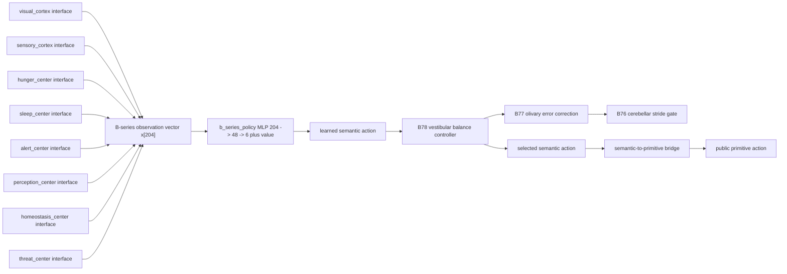
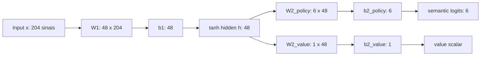
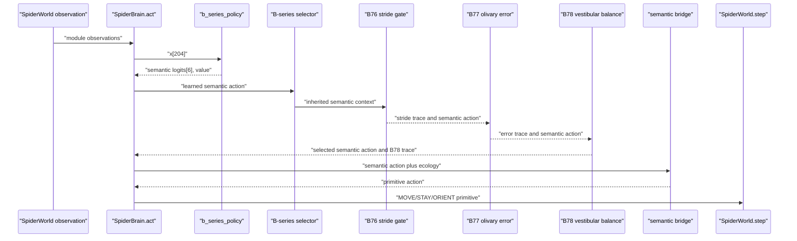

# Documentacao Da Arquitetura Atual B-Series B78

Atualizado em 2026-06-05.

Este documento descreve o melhor estado validado atual da linha B-series:
`b78_vestibular_balance_h48_bridge_policy`, aceito no checkpoint `best` da seed
7. Ele tambem registra o backup local feito antes desta documentacao. O backup
preserva o estado executavel em `ff00c81`; o commit desta documentacao e
posterior e nao altera o checkpoint aceito.

## 1. Estado Preservado

| Item | Valor |
| --- | --- |
| Commit preservado | `ff00c81` |
| Tag de backup | `backup/b78-best-2026-06-05` |
| Variante aceita | `b78_vestibular_balance_h48_bridge_policy` |
| Status | `accepted` |
| Seed | `7` |
| Checkpoint aceito | `artifacts/b_series/evolution/b78_vestibular_balance_h48_bridge_policy/seed_7/best` |
| Arquivo de pesos | `b_series_policy.npz` |
| Metadata | `metadata.json` |
| Report da tentativa | `artifacts/b_series/evolution/b78_vestibular_balance_h48_bridge_policy/seed_7/attempt_report.json` |
| Sumario da evolucao | `artifacts/b_series/evolution/b78_evolution_summary.json` |

Backup local criado em:

```text
backups/2026-06-05-b78-best-ff00c81/
```

Conteudo do backup:

| Arquivo | Papel | SHA-256 |
| --- | --- | --- |
| `repo-ff00c81.bundle` | Bundle Git completo do snapshot preservado | `4b7ed90b002bfb5d4c1a535aed403592512aadf1e77f05b318e82a4368055f7d` |
| `b78-best-checkpoint.tar.gz` | Checkpoint B78 `best` e reports associados | `aa845b000ddbb383548031f1335e8be6b8d9955e66581b66ec8db23fdadc46f8` |
| `MANIFEST.txt` | Manifesto humano do backup | `20012aebdbf961b5b3dae1f3534b6f31bb27869d36103c836bc63117acd08540` |
| `SHA256SUMS` | Hashes verificaveis do backup | `d8677cbaca31eb064c89411dd6b48101d3c4e333c0eae0409f8a5c3970297cf4` |

Restauracao esperada:

```bash
git clone backups/2026-06-05-b78-best-ff00c81/repo-ff00c81.bundle restored-biong-b78
tar -xzf backups/2026-06-05-b78-best-ff00c81/b78-best-checkpoint.tar.gz -C restored-biong-b78
cd restored-biong-b78
git checkout ff00c81
```

O tar do checkpoint preserva os caminhos `artifacts/...`, portanto deve ser
extraido na raiz do clone restaurado.

## 2. Resumo Executivo

B78 e uma fase B-series em `current_bridge`: a politica treinavel ainda emite
seis acoes semanticas internas, mas o mundo publico continua recebendo somente
as nove acoes primitivas de locomocao/orientacao. O ganho de B78 nao e um novo
espaco de acao publico; e uma camada vestibular de equilibrio que envolve a
pilha B77/B76 e ajusta quando preservar, segurar ou liberar a intencao
semantica antes da ponte para a acao primitiva.

O checkpoint salvo contem exatamente uma rede neural treinavel:
`b_series_policy`. Os centros e cortices listados na assinatura arquitetural
funcionam aqui como contratos de observacao e capacidade: seus sinais sao
concatenados para formar o vetor de entrada da politica B-series. Eles nao
possuem arquivos `.npz` separados neste checkpoint B78.



## 3. Assinatura E Compatibilidade

| Campo | Valor |
| --- | --- |
| `architecture_version` | `25` |
| `architecture_fingerprint` | `4c025d9cb808ed0c7a155161c310435191eb681e40b4c3e9c5c311bbacdff9cd` |
| `registry_fingerprint` | `cf7df9f21d3a0527bd676a63b010ee22a72edd16e86aa52610a2cb564cd45ce8` |
| `architecture` | `b_series` |
| `b_mode` | `current_bridge` |
| `b_level` | `78` |
| `b_parent_level` | `77` |
| `b_hidden_dim` | `48` |
| `b_controller_profile` | `vestibular_balance` |
| `capacity_profile_name` | `current` |
| `action_dim` publico | `9` |
| `semantic output_dim` interno | `6` |

Contratos preservados:

- `SpiderWorld.step()` recebe apenas acoes primitivas.
- A politica B-series emite apenas as seis acoes semanticas internas.
- O checkpoint salva `b_series_policy.npz` e `metadata.json`.
- A compatibilidade de checkpoint e validada por versao de arquitetura,
  assinatura arquitetural, registry de interfaces, config de ablation e perfil
  operacional.
- Transfer learning B-series e feito por nome de parametro e sobreposicao de
  shape, com coverage minimo padrao `0.50`.

## 4. Rede Neural Salva

Arquitetura ativa no checkpoint:



Formula da rede ativa:

```text
h = tanh(W1 @ x + b1)
semantic_logits = clip(W2_policy @ h + b2_policy, -20, 20)
value = W2_value @ h + b2_value
```

Contagem de parametros do checkpoint:

| Array | Shape | Parametros |
| --- | ---: | ---: |
| `W1` | `(48, 204)` | `9,792` |
| `b1` | `(48,)` | `48` |
| `W2_policy` | `(6, 48)` | `288` |
| `b2_policy` | `(6,)` | `6` |
| `W2_value` | `(1, 48)` | `48` |
| `b2_value` | `(1,)` | `1` |
| **Total** |  | **`10,183`** |

O checkpoint registra:

```json
{
  "parameter_counts": {"b_series_policy": 10183},
  "total_parameters": 10183
}
```

### 4.1 Acoes Internas E Publicas

Acoes semanticas internas da B-series:

| Indice | Acao semantica |
| ---: | --- |
| 0 | `MOVE_TO_FOOD` |
| 1 | `MOVE_TO_SHELTER` |
| 2 | `EXPLORE` |
| 3 | `STAY` |
| 4 | `EAT` |
| 5 | `SLEEP` |

Acoes primitivas publicas:

| Indice | Acao primitiva |
| ---: | --- |
| 0 | `MOVE_UP` |
| 1 | `MOVE_DOWN` |
| 2 | `MOVE_LEFT` |
| 3 | `MOVE_RIGHT` |
| 4 | `STAY` |
| 5 | `ORIENT_UP` |
| 6 | `ORIENT_DOWN` |
| 7 | `ORIENT_LEFT` |
| 8 | `ORIENT_RIGHT` |

`MOVE_TO_FOOD`, `MOVE_TO_SHELTER` e `EXPLORE` sao convertidas em movimento
primitivo nao bloqueado pela ponte semantica. `STAY`, `EAT` e `SLEEP` chegam ao
mundo como `STAY`; comer e dormir continuam sendo efeitos da dinamica do
ambiente, nao novas acoes publicas.

## 5. Modulos De Observacao

A entrada de tamanho 204 e a concatenacao das oito interfaces abaixo.

| Modulo | Observation key | Papel | Versao | Sinais | Hidden dim declarado | Outputs primitivos | Params se `ProposalNetwork` modular |
| --- | --- | --- | ---: | ---: | ---: | ---: | ---: |
| `visual_cortex` | `visual` | `proposal` | 7 | 32 | 32 | 9 | 1,353 |
| `sensory_cortex` | `sensory` | `proposal` | 2 | 12 | 28 | 9 | 625 |
| `hunger_center` | `hunger` | `proposal` | 4 | 18 | 26 | 9 | 737 |
| `sleep_center` | `sleep` | `proposal` | 5 | 18 | 24 | 9 | 681 |
| `alert_center` | `alert` | `proposal` | 8 | 27 | 28 | 9 | 1,045 |
| `perception_center` | `perception` | `proposal` | 1 | 42 | 36 | 9 | 1,881 |
| `homeostasis_center` | `homeostasis` | `proposal` | 1 | 28 | 28 | 9 | 1,073 |
| `threat_center` | `threat` | `proposal` | 1 | 27 | 28 | 9 | 1,045 |
| **Total** |  |  |  | **204** |  |  | **8,440** |

Os parametros da ultima coluna sao informativos: eles descrevem quanto cada
modulo teria se a arquitetura modular `ProposalNetwork(input, hidden, 9)` fosse
instanciada. No checkpoint B78 aceito esses pesos nao existem separadamente; a
rede salva e a MLP B-series unica de 10,183 parametros.

Formula de `ProposalNetwork` modular:

```text
params = input_dim * hidden_dim + hidden_dim + hidden_dim * output_dim + output_dim
```

### 5.1 Catalogo De Sinais

`visual_cortex` recebe 32 sinais:
`food_visible`, `food_certainty`, `food_occluded`, `food_dx`, `food_dy`,
`shelter_visible`, `shelter_certainty`, `shelter_occluded`, `shelter_dx`,
`shelter_dy`, `predator_visible`, `predator_certainty`, `predator_occluded`,
`predator_dx`, `predator_dy`, `heading_dx`, `heading_dy`, `foveal_scan_age`,
`food_trace_strength`, `food_trace_heading_dx`, `food_trace_heading_dy`,
`shelter_trace_strength`, `shelter_trace_heading_dx`, `shelter_trace_heading_dy`,
`predator_trace_strength`, `predator_trace_heading_dx`,
`predator_trace_heading_dy`, `predator_motion_salience`,
`visual_predator_threat`, `olfactory_predator_threat`, `day`, `night`.

`sensory_cortex` recebe 12 sinais:
`recent_pain`, `recent_contact`, `health`, `hunger`, `fatigue`,
`food_smell_strength`, `food_smell_dx`, `food_smell_dy`,
`predator_smell_strength`, `predator_smell_dx`, `predator_smell_dy`, `light`.

`hunger_center` recebe 18 sinais:
`hunger`, `on_food`, `food_visible`, `food_certainty`, `food_occluded`,
`food_dx`, `food_dy`, `food_smell_strength`, `food_smell_dx`, `food_smell_dy`,
`food_trace_dx`, `food_trace_dy`, `food_trace_strength`,
`food_trace_heading_dx`, `food_trace_heading_dy`, `food_memory_dx`,
`food_memory_dy`, `food_memory_age`.

`sleep_center` recebe 18 sinais:
`fatigue`, `hunger`, `on_shelter`, `night`, `health`, `recent_pain`,
`sleep_phase_level`, `rest_streak_norm`, `sleep_debt`, `shelter_role_level`,
`shelter_trace_dx`, `shelter_trace_dy`, `shelter_trace_strength`,
`shelter_trace_heading_dx`, `shelter_trace_heading_dy`, `shelter_memory_dx`,
`shelter_memory_dy`, `shelter_memory_age`.

`alert_center` recebe 27 sinais:
`predator_visible`, `predator_certainty`, `predator_occluded`, `predator_dx`,
`predator_dy`, `predator_smell_strength`, `predator_motion_salience`,
`visual_predator_threat`, `olfactory_predator_threat`,
`dominant_predator_none`, `dominant_predator_visual`,
`dominant_predator_olfactory`, `recent_pain`, `recent_contact`, `on_shelter`,
`night`, `predator_trace_dx`, `predator_trace_dy`, `predator_trace_strength`,
`predator_trace_heading_dx`, `predator_trace_heading_dy`,
`predator_memory_dx`, `predator_memory_dy`, `predator_memory_age`,
`escape_memory_dx`, `escape_memory_dy`, `escape_memory_age`.

`perception_center` recebe 42 sinais:
`food_visible`, `food_certainty`, `food_dx`, `food_dy`, `shelter_visible`,
`shelter_certainty`, `shelter_dx`, `shelter_dy`, `predator_visible`,
`predator_certainty`, `predator_dx`, `predator_dy`, `heading_dx`, `heading_dy`,
`foveal_scan_age`, `food_smell_strength`, `food_smell_dx`, `food_smell_dy`,
`predator_smell_strength`, `predator_smell_dx`, `predator_smell_dy`, `light`,
`day`, `night`, `food_trace_strength`, `food_trace_heading_dx`,
`food_trace_heading_dy`, `shelter_trace_strength`,
`shelter_trace_heading_dx`, `shelter_trace_heading_dy`,
`predator_trace_strength`, `predator_trace_heading_dx`,
`predator_trace_heading_dy`, `food_memory_dx`, `food_memory_dy`,
`food_memory_age`, `shelter_memory_dx`, `shelter_memory_dy`,
`shelter_memory_age`, `predator_memory_dx`, `predator_memory_dy`,
`predator_memory_age`.

`homeostasis_center` recebe 28 sinais:
`hunger`, `fatigue`, `health`, `on_food`, `on_shelter`, `day`, `night`,
`sleep_phase_level`, `rest_streak_norm`, `sleep_debt`, `shelter_role_level`,
`food_visible`, `food_certainty`, `food_smell_strength`, `food_smell_dx`,
`food_smell_dy`, `food_trace_dx`, `food_trace_dy`, `food_trace_strength`,
`food_memory_dx`, `food_memory_dy`, `food_memory_age`, `shelter_trace_dx`,
`shelter_trace_dy`, `shelter_trace_strength`, `shelter_memory_dx`,
`shelter_memory_dy`, `shelter_memory_age`.

`threat_center` recebe 27 sinais:
`predator_visible`, `predator_certainty`, `predator_dx`, `predator_dy`,
`predator_smell_strength`, `predator_smell_dx`, `predator_smell_dy`,
`predator_motion_salience`, `visual_predator_threat`,
`olfactory_predator_threat`, `dominant_predator_none`,
`dominant_predator_visual`, `dominant_predator_olfactory`, `recent_pain`,
`recent_contact`, `health`, `on_shelter`, `night`, `predator_trace_dx`,
`predator_trace_dy`, `predator_trace_strength`, `predator_memory_dx`,
`predator_memory_dy`, `predator_memory_age`, `escape_memory_dx`,
`escape_memory_dy`, `escape_memory_age`.

## 6. Contextos Declarados

Mesmo que B78 nao instancie `action_center` e `motor_cortex`, a assinatura da
arquitetura mantem os contextos usados pelas familias modular/monolitica para
compatibilidade e comparacao.

| Contexto | Observation key | Versao | Sinais |
| --- | --- | ---: | ---: |
| `action_center_context` | `action_context` | 3 | 15 |
| `motor_cortex_context` | `motor_context` | 5 | 14 |

`action_center_context`:
`hunger`, `fatigue`, `health`, `recent_pain`, `recent_contact`, `on_food`,
`on_shelter`, `predator_visible`, `predator_certainty`, `day`, `night`,
`last_move_dx`, `last_move_dy`, `sleep_debt`, `shelter_role_level`.

`motor_cortex_context`:
`on_food`, `on_shelter`, `predator_visible`, `predator_certainty`, `day`,
`night`, `last_move_dx`, `last_move_dy`, `shelter_role_level`, `heading_dx`,
`heading_dy`, `terrain_difficulty`, `fatigue`, `momentum`.

Capacidade declarada no perfil `current`:

| Componente | Hidden dim | Observacao |
| --- | ---: | --- |
| Modulos propositores | 24 a 36, conforme tabela de modulos | Nao instanciados como pesos separados em B78 |
| `action_center` | 32 | Usado em arquiteturas modular/monolitica, nao na B-series ativa |
| `motor_cortex` | 32 | Usado em arquiteturas modular/monolitica, nao na B-series ativa |
| `arbitration_network` | 0 em B78 | O perfil base declara 32, mas B-series nao instancia arbitragem |
| `b_series_policy` | 48 | Rede ativa salva |

Se a arquitetura modular completa fosse instanciada com estes contratos,
`action_center` teria `MotorNetwork(input=87, hidden=32, output=9)` e 3,146
parametros; `motor_cortex` teria `ProposalNetwork(input=23, hidden=32,
output=9)` e 1,065 parametros. Esses numeros nao entram no total salvo de B78.

## 7. Fluxo De Decisao Em Runtime

No caminho B-series ativo, `SpiderBrain.act()` executa a sequencia:

1. Monta o vetor monolitico de observacao com as oito interfaces.
2. Executa `b_series_policy.forward(...)` para obter logits semanticos e value.
3. Escolhe a acao semantica aprendida por amostragem ou argmax.
4. Chama `_select_b_series_semantic_action(...)`.
5. Em B78, o seletor efetivo passa pela pilha B76/B77/B78.
6. A ponte `bridge_b_semantic_action(...)` converte a semantica em uma acao
   primitiva valida.
7. O retorno `BrainStep` registra logits, politica, acao semantica, decisao da
   ponte, primitivas e trace B-series.



## 8. Pilha Bioinspirada B76-B78

B78 foi promovida sobre uma base recente de controle locomotor:

| Nivel | Perfil | Papel | Principais sinais de trace | Decisoes principais |
| --- | --- | --- | --- | --- |
| B76 | `cerebellar_stride_gate` | Timing cerebelar de passada e suavizacao de burst | `b76_stride_timing_signal`, `b76_error_correction`, `b76_burst_smoothing`, `b76_stride_gate`, `b76_stride_lock` | `preserve_b75`, `continue_stride_lock`, `cerebellar_stride_hold`, `timed_stride_release`, `smoothed_burst_stride` |
| B77 | `olivary_error_correction` | Erro de predicao e drive tipo fibra trepadeira sobre B76 | `b77_prediction_error`, `b77_climbing_fiber_drive`, `b77_corrective_timing`, `b77_stability_confidence`, `b77_error_lock` | `preserve_b76`, `continue_error_lock`, `olivary_error_hold`, `corrective_stride_release`, `stabilized_stride_release` |
| B78 | `vestibular_balance` | Erro de equilibrio, estabilizacao de cabeca e confianca locomotora sobre B77 | `b78_balance_error`, `b78_head_stabilization`, `b78_locomotor_confidence`, `b78_slip_risk`, `b78_balance_lock` | `preserve_b77`, `continue_balance_lock`, `vestibular_balance_hold`, `stabilized_corridor_release`, `balance_recovery_stride` |

B78 le sinais de B77 e sinais ecologicos atuais. Em mapas `corridor_escape`, o
controlador pode:

- manter `SLEEP` quando ha lock de equilibrio perto do abrigo;
- iniciar hold vestibular quando erro de equilibrio e risco de escorregamento
  ficam acima do limiar;
- liberar `MOVE_TO_FOOD` quando estabilizacao de cabeca e confianca locomotora
  passam o limiar e a fome justifica avancar;
- preservar B77 quando o contexto nao exige intervencao vestibular.

Parametros padrao do controlador B78:

| Parametro | Valor |
| --- | ---: |
| `b78_balance_decay` | 0.90 |
| `b78_error_gain` | 0.34 |
| `b78_stabilization_gain` | 0.32 |
| `b78_confidence_gain` | 0.30 |
| `b78_hold_threshold` | 0.18 |
| `b78_release_threshold` | 0.30 |
| `b78_balance_lock_ticks` | 4.0 |

## 9. Transfer Learning

B78 foi inicializada a partir do checkpoint aceito de B77:

```text
artifacts/b_series/evolution/b77_olivary_error_correction_h48_bridge_policy/seed_7/best
```

Relatorio de transferencia salvo no metadata:

| Campo | Valor |
| --- | --- |
| `source_checkpoint` | `artifacts/b_series/evolution/b77_olivary_error_correction_h48_bridge_policy/seed_7/best` |
| `source_metadata_sha256` | `1b3726ec23ca54d0952a5e1a17019808e21e82aa8da3f587ed867149e47ebbf9` |
| `source_architecture_fingerprint` | `1404980bf5acd1dfaf1f0433f627e8a9d9e0de67b1504fba6674e42f30ae461a` |
| `parent_level` | `77` |
| `target_b_level` | `78` |
| `coverage` | `1.0` |
| `loaded_parameter_count` | `10,183` |
| `target_parameter_count` | `10,183` |
| `min_coverage` | `0.5` |
| `allow_low_coverage` | `false` |

Chaves carregadas integralmente:

```text
W1, b1, W2_policy, b2_policy, W2_value, b2_value
```

Nao houve chaves parcialmente carregadas, puladas ou inicializadas do zero.

## 10. Gates E Sobrevivencia

O estado B78 esta aceito pelos gates registrados em
`attempt_report.json`. A aranha nao sobreviveu ate o horizonte maximo em todos
os episodios canonicos, mas passou os pisos e agregados definidos para a fase.

Resumo dos gates:

| Gate | Status | Evidencia |
| --- | --- | --- |
| Easy survival | accepted | 5 episodios vivos, horizonte completo, comida, abrigo, sono e trace primitivo validos |
| Canonical aggregate | accepted | `completed_horizons=5`, `min_steps=52`, `food_cycle_episodes=9`, `shelter_cycle_episodes=10`, `sleep_cycle_episodes=9`, `total_predator_contacts=24` |
| Corridor B78 | accepted | `base_b77_corridor_diagnostic=true`, 3 episodios com decisao B78 explicita, seguranca, erro de equilibrio, estabilizacao, confianca locomotora, risco de slip e lock/release |
| Food deprivation | accepted | `progress_episodes=2` |
| Sleep conflict | accepted | `post_recovery_movement_episodes=3` |
| Food predator conflict | accepted | 3 episodios com exposicao de ameaca e prioridade/supressao de ameaca |

O gate canonico registra 10 episodios avaliados. Cinco chegaram ao horizonte de
300 passos; os demais ainda satisfizeram o piso minimo e demais checks
definidos pelo protocolo dessa fase. Portanto a leitura correta e: B78 esta
validada como checkpoint aceito e apresenta sobrevivencia significativa sob os
gates atuais, mas ainda nao representa sobrevivencia perfeita em todos os
cenarios canonicos.

## 11. Artefatos E Fontes

Arquivos de codigo centrais:

| Arquivo | Papel |
| --- | --- |
| `spider_cortex_sim/agent.py` | Instancia `SpiderBrain`; no modo B-series cria `TrueMonolithicNetwork(input=204, hidden=48, output=6)` |
| `spider_cortex_sim/brain/runtime_action_loop.py` | Executa `act()`, monta observacao B-series, roda a politica, chama seletor Bx e ponte semantica |
| `spider_cortex_sim/brain/runtime_b76_semantics.py` | Controlador B76 cerebelar de timing/passada |
| `spider_cortex_sim/brain/runtime_b77_semantics.py` | Controlador B77 de erro olivar |
| `spider_cortex_sim/brain/runtime_b78_semantics.py` | Controlador B78 vestibular de equilibrio |
| `spider_cortex_sim/brain/persistence.py` | Salva/carrega metadata, pesos e transferencia B-series |
| `spider_cortex_sim/b_series.py` | Constantes B-series, acoes semanticas, ponte semantica e nomes das variantes |
| `spider_cortex_sim/nn_internal/motor.py` | `MotorNetwork` e `TrueMonolithicNetwork` |
| `spider_cortex_sim/nn_internal/proposal.py` | `ProposalNetwork` modular |

Artefatos centrais:

| Arquivo | Papel |
| --- | --- |
| `artifacts/b_series/evolution/b78_vestibular_balance_h48_bridge_policy/seed_7/best/b_series_policy.npz` | Pesos treinaveis salvos de B78 |
| `artifacts/b_series/evolution/b78_vestibular_balance_h48_bridge_policy/seed_7/best/metadata.json` | Assinatura arquitetural, config, interfaces, parametros e transferencia |
| `artifacts/b_series/evolution/b78_vestibular_balance_h48_bridge_policy/seed_7/attempt_report.json` | Gates e metricas da tentativa aceita |
| `artifacts/b_series/evolution/b78_evolution_summary.json` | Sumario da promocao B78 |

## 12. Contrato Pratico Para A Proxima Fase

Para continuar em B79 ou posterior sem quebrar este estado:

1. Usar como fonte inicial o checkpoint `best` de B78.
2. Preservar o action space publico primitivo.
3. Se a rede ativa continuar com shapes identicos, exigir transfer coverage
   `1.0`; se aumentar capacidade, registrar coverage parcial e motivo.
4. Registrar novo `b_controller_profile`, novos traces e decisao explicita.
5. Nao promover fase sem gates focados e regressao B-series relevante.
6. Atualizar docs/reports apenas depois que o checkpoint aceito existir.

Este documento descreve o estado B78; ele nao deve ser usado para inferir que
modulos nao instanciados no checkpoint tenham pesos salvos.
